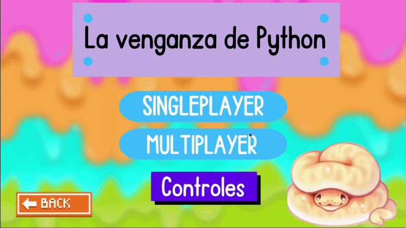

# 🐍 Snake Game — Python (La venganza de Python)

A classic **Snake game built with Python and Pygame**, featuring multiple game modes, customizable maps, obstacles, and special fruits with gameplay effects.

This project was originally developed as a **first-semester group assignment** in a programming course and later reconstructed and cleaned for my GitHub portfolio.

---

# 🎮 Gameplay

## Singleplayer


## Multiplayer



---

# ✨ Features

* Classic **Snake gameplay**
* **Singleplayer mode**
* **Local multiplayer mode**
* **Custom map sizes**
* **Map color themes**
* **Optional obstacles**
* **Special fruits with unique effects**
* Sound effects and background music
* Interactive menu system

---

# 🍎 Special Fruits

Besides the classic fruit, the game includes **special fruits that trigger unique effects**, adding strategy and unpredictability to the gameplay.

| Fruit    | Effect                                       |
| -------- | -------------------------------------------- |
| 🍎 Apple | Standard fruit that increases the snake size |
| ☕ Java   | Inverts the player's controls                |
| 🔴 R     | Reduces the snake back to its original size  |

---

# 🕹 Controls

### Player 1

| Key | Action     |
| --- | ---------- |
| ↑   | Move Up    |
| ↓   | Move Down  |
| →   | Move Right |
| ←   | Move Left  |

### Player 2 (Multiplayer)

| Key | Action     |
| --- | ---------- |
| W   | Move Up    |
| S   | Move Down  |
| D   | Move Right |
| A   | Move Left  |

---

# 🧰 Technologies

* Python
* Pygame

---

# 📦 Installation

Clone the repository:

```bash
git clone https://github.com/J-Huertas/SnakeGame.git
cd SnakeGame
```

Install dependencies:

```bash
pip install -r requirements.txt
```

Run the game:

```bash
python snake_game.py
```

---

# 📂 Project Structure

```
SnakeGame/
│
├── Graphics/                 # Game assets (sprites, interface, sounds)
│
├── demo_singleplayer.gif     # Gameplay demo (singleplayer)
├── demo_multiplayer.gif      # Gameplay demo (multiplayer)
│
├── snake_game.py             # Main game file
├── requirements.txt          # Python dependencies
├── README.md                 # Project documentation
└── .gitignore
```

---

# 👥 Credits

This project was originally developed as a **group assignment** during a programming course.
The version available in this repository was **reconstructed and organized by me for portfolio purposes**.

---

# 👨‍💻 Author

**Juan Esteban Cárdenas Huertas**

Systems Engineering Student

Software Developer / Backend Developer

GitHub:
https://github.com/J-Huertas
